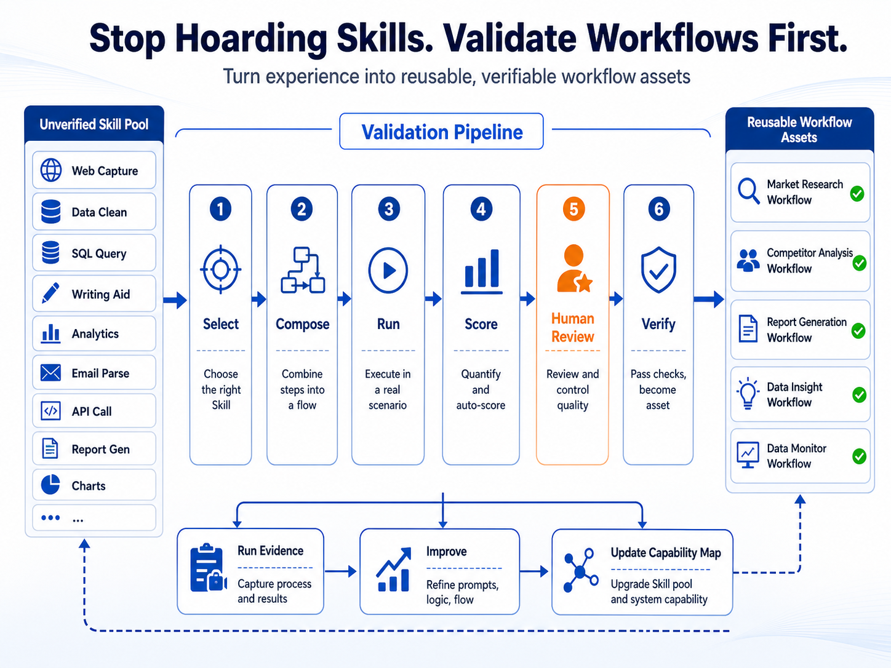
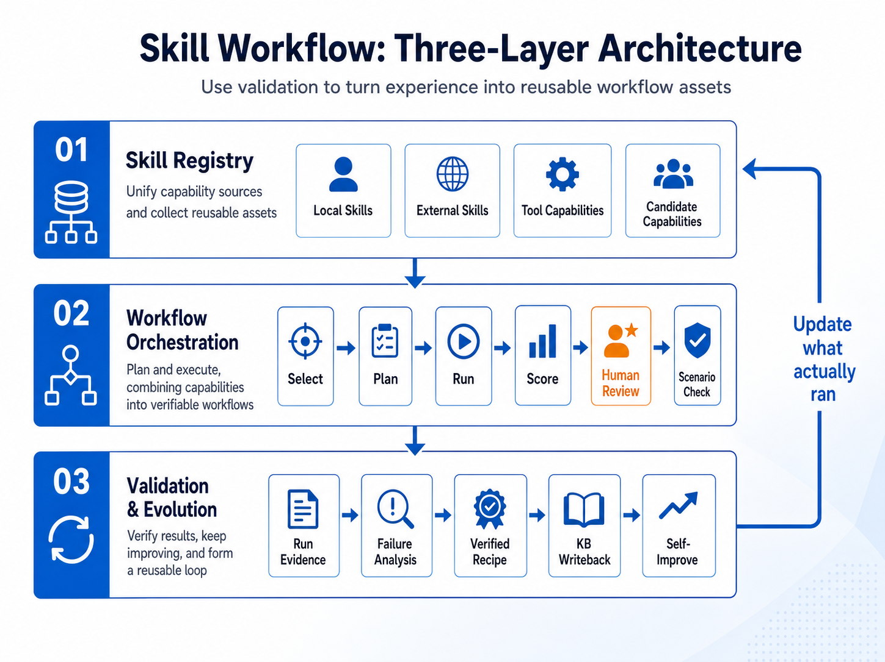
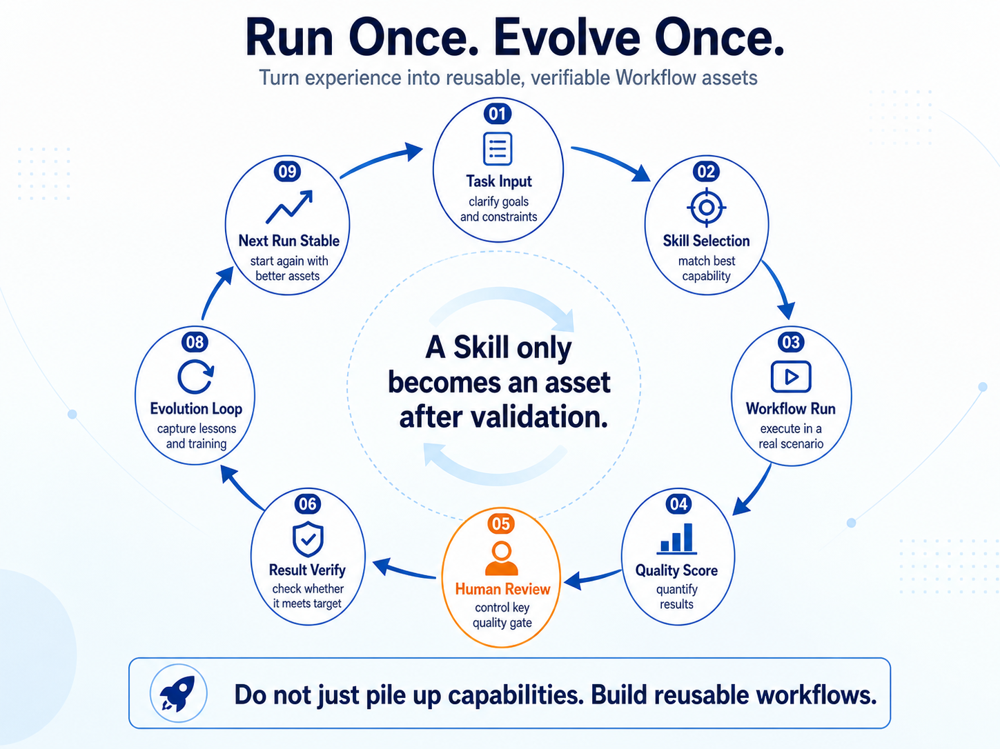

<div align="center">

<h1>awesome-skill-workflows</h1>

<h3>Validate Agent Workflows Before Promoting Skills</h3>

<p>
  Evidence-first workflows for turning successful AI agent runs into reusable, measurable, and improvable skill assets.
</p>

<p>
  
  
  
  
</p>

<p>
  <a href="./docs/architecture.md"><strong>Architecture</strong></a> &bull;
  <a href="./docs/workflow-knowledge-base.md"><strong>Workflow KB</strong></a> &bull;
  <a href="./verified-recipes/xhs-ai-agent-save-one-hour.recipe.md"><strong>Verified Recipe</strong></a> &bull;
  <a href="./reports/first-mvp-validation-report.md"><strong>MVP Report</strong></a> &bull;
  <a href="./AGENTS.md"><strong>Agent Rules</strong></a>
</p>

</div>

---

`awesome-skill-workflows` is **not** a Xiaohongshu tool.

It is a lightweight framework for turning repeated agent work into reusable,
measurable, and improvable skill/workflow assets.



## Why This Exists

Agent teams often collect many isolated skills, prompts, scripts, and tool tricks. That is useful, but it is not enough. A skill only becomes valuable when it can be selected, composed, run, reviewed, verified, and reused.

This repository treats workflows as the durable asset:

- skills are capability units,
- workflows are composed execution paths,
- scenarios are validation wrappers,
- run evidence is the proof layer,
- the workflow knowledge base is the reusable memory,
- self-evolution turns failures and review notes into better future assets.

## What This Project Is

This repository is a framework for:

1. Skill Aggregation
2. Skill Self-Evolution
3. Workflow Knowledge Base

The long-term goal is to turn repeatable workflows into reusable, measurable, and improvable skill assets.

## Core Idea



The repository separates reusable architecture from scenario validation:

- **Layer 1: Core skill architecture**
  - skill discovery and normalization
  - workflow composition
  - scoring and gate evidence
  - knowledge-base writeback
  - self-evolution from run evidence
- **Layer 2: Scenario validation**
  - concrete scenario wrappers
  - scenario-specific risk gates
  - run records and proof artifacts
  - human-reviewed action handoff

A scenario can prove the architecture, but it must not define the architecture.

## Workflow Loop



Every useful run should make the next run better:

1. clarify the task and constraints,
2. select the best matching skill assets,
3. compose and run the workflow,
4. score the result,
5. pass human review for high-risk steps,
6. verify whether the output actually met the target,
7. capture failure cases and reusable evidence,
8. update the knowledge base,
9. start the next run with better assets.

## v0.1 Validation Scenario

Version `v0.1` uses **Xiaohongshu AI tool content publishing** as the validation scenario.

This scenario exists only to validate the platform design:

- the core skill architecture can absorb a real workflow
- the workflow can be reviewed by a human before high-risk actions
- success and failure can be captured into the knowledge base
- the system can reuse prior work in a second scenario

The validation scenario is intentionally concrete, but the architecture is meant to transfer to other repeatable agent workflows such as market research, competitor analysis, report generation, data monitoring, and operational review loops.

## MVP Acceptance Loop

The MVP is considered complete only when the following loop works end to end:

1. define a workflow scenario
2. capture raw discovery
3. structure it into skills, workflows, and recipes
4. run or simulate the workflow
5. record results, failures, and reusable patterns
6. feed the outcome back into the workflow knowledge base
7. use the updated knowledge base in the next run

## Repository Layout

- `docs/`: architecture, principles, scoring, and scenario boundaries
- `skills/`: reusable skill assets
- `workflows/`: workflow definitions and orchestration layer
- `scenarios/`: scenario-specific validation wrappers
- `workflow-kb/`: knowledge assets and retrieval index, including verified assets and explicitly failed evidence
- `runs/`: scenario run records
- `evolution/`: self-evolution outputs and refinement artifacts
- `verified-recipes/`: proven reusable recipes
- `failed-recipes/`: recipes that produced reusable evidence but failed promotion gates
- `reports/`: generated summaries and review outputs
- `schemas/`: JSON schemas for skills, workflows, scoring, gate ledgers, recipes, and verification records
- `scripts/`: project validators and promotion gate checks

## Evidence Map

Use these files to understand the current validated state:

| Question | Primary evidence |
| --- | --- |
| What is the system architecture? | `docs/architecture.md` |
| What principles constrain the project? | `docs/principles.md` |
| What is the current scenario? | `scenarios/xiaohongshu-creator/scenario.md` |
| What workflow was validated? | `workflows/xiaohongshu/xhs-ai-tool-topic-to-post.workflow.md` |
| What run passed draft validation? | `runs/003-xhs-ai-agent-save-one-hour-step8-draft-rerun/` |
| What recipe is verified? | `verified-recipes/xhs-ai-agent-save-one-hour.recipe.md` |
| What failed evidence is preserved? | `failed-recipes/xhs-ai-agent-save-one-hour.recipe.md` |
| What reusable workflow is in the KB? | `workflow-kb/verified-workflows/xhs-ai-tool-topic-to-post.v1.md` |
| How does retrieval find reusable assets? | `workflow-kb/retrieval-index.json` |
| What is the MVP verdict? | `reports/first-mvp-validation-report.md` |

## Current MVP Status

The current MVP scope is **compliant draft validation**, not live publishing.

The validated path proves that the workflow can:

1. discover and normalize skills,
2. compose a scenario workflow,
3. generate and score content,
4. pass human review and risk approval,
5. confirm account state before handoff,
6. save a compliant draft without clicking publish,
7. write reusable success and failure evidence back into the knowledge base,
8. reuse the knowledge base in a second scenario run.

See:

- `reports/first-mvp-validation-report.md`
- `verified-recipes/xhs-ai-agent-save-one-hour.recipe.md`
- `workflow-kb/verified-workflows/xhs-ai-tool-topic-to-post.v1.md`

## How To Use This Repository

### Read First

Start with:

1. `AGENTS.md` for agent operating rules.
2. `docs/architecture.md` for the system model.
3. `docs/workflow-knowledge-base.md` for KB writeback rules.
4. `scenarios/<scenario>/` for scenario-specific boundaries.
5. `workflow-kb/retrieval-index.json` before starting any new run.

### Run A New Scenario

For a new workflow scenario:

1. Define the scenario boundary in `scenarios/`.
2. Capture raw skill discovery in `skills/raw-discovery/`.
3. Normalize reusable capabilities into `skills/`.
4. Compose the workflow in `workflows/`.
5. Run or simulate the workflow and store evidence in `runs/`.
6. Score the result and record human review or gate evidence.
7. Write reusable outcomes into `workflow-kb/`.
8. Promote only verified recipes into `verified-recipes/`.
9. Store failed but useful evidence in `failed-recipes/` or `workflow-kb/failure-cases/`.

Before starting a new run, query `workflow-kb/retrieval-index.json` and the referenced KB files to avoid rediscovering known patterns.

### Promote An Asset

Before promoting a workflow or recipe:

1. Confirm the run has evidence under `runs/`.
2. Confirm human review and risk gates when required.
3. Confirm proof matches the approved mode.
4. Keep failed evidence under failed namespaces.
5. Update the retrieval index only with reusable assets.
6. Run the promotion validator.

## Promotion Rules

Do not promote a workflow or recipe because it looks useful. Promotion requires evidence.

- Failed recipes do not belong in `verified-recipes/`.
- Failed workflows do not belong in `workflow-kb/verified-workflows/`.
- A quality score is not the same as human review, risk approval, account-state proof, or draft/publish proof.
- Verified assets need explicit evidence references.
- Incomplete or blocked runs should remain as run evidence plus an evolution note or failure case.
- Live publish verification is separate from draft verification.

For the current Xiaohongshu scenario, `draft_verified` means human review, risk approval, account-state check, compliant draft proof, and `clicked_publish=false` all passed.

## Safety Boundaries

High-risk actions require human review. This repository should not be used for fully autonomous account actions.

Do not commit:

- local browser profiles,
- cookies or session files,
- `.env` files,
- credentials or private keys,
- scratch plans or local agent progress notes.

The `.gitignore` excludes known local-sensitive paths such as `.gstack/`, `.xhs-creator-profile/`, cookie JSON files, and local team planning files.

## Validation

Run the validators after changing schemas, workflows, recipes, KB entries, reports, or promotion evidence:

```bash
node scripts/validate-mvp-acceptance.mjs
node scripts/validate-promotion-gates.mjs
```

Expected current result:

- MVP acceptance: `PASS`
- Promotion gates: `passed`

## Development Notes

- The repository intentionally stores both successful and failed evidence.
- Failed evidence is useful, but it must not be stored in verified paths.
- Screenshots and browser proof are run evidence, not source-of-truth architecture.
- High-risk account-bound actions require human review.
- Refactors should be atomic: change one coherent asset boundary, validate it, then commit.

## Agent Rules

Agent behavior is defined in `AGENTS.md`.

Key operating expectations:

- keep Layer 1 scenario-agnostic,
- keep scenario-specific assumptions local to the scenario,
- make refactors and submissions atomic,
- validate before promotion,
- preserve sensitive local files outside git.
