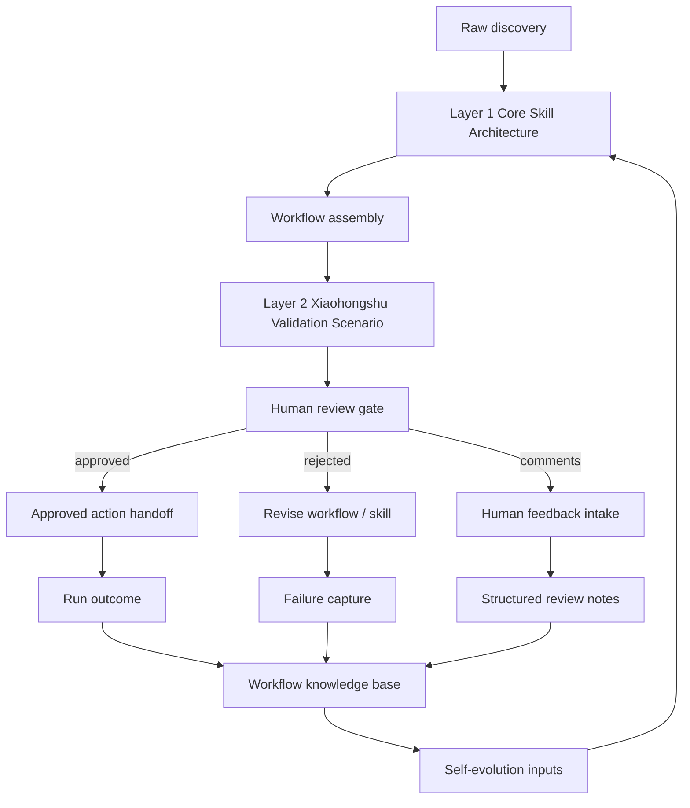

# Architecture

## Overall View

## Layer 1 Core Skill Architecture

This layer is the reusable foundation.

Responsibilities:

- define skill primitives and packaging conventions
- ingest raw discoveries from real work
- normalize workflows into reusable modules
- score outputs and capture evaluation signals
- generate evolution inputs from observed outcomes

This layer must remain scenario-agnostic.

## Layer 2 Xiaohongshu Validation Scenario

This layer is a validation wrapper, not the product boundary.

Responsibilities:

- provide one concrete scenario for proving the architecture
- define the reviewed action handoff flow for the validation scenario
- map reusable skills into a real user-facing workflow
- capture scenario-specific success/failure evidence
- normalize human review comments into structured evolution inputs

This layer may contain Xiaohongshu-specific assumptions, but those assumptions must not leak upward into Layer 1.

## Data Flow

1. raw discovery enters the system
2. discovery is structured into skill artifacts and workflow assets
3. the workflow is composed for the Xiaohongshu validation scenario
4. a human review gate checks high-risk actions
5. structured human feedback is captured before handoff
6. the run outcome is recorded
7. successes and failures are written into the workflow knowledge base
8. the knowledge base feeds the next iteration of the core architecture

## Module Boundaries

- `skills/`: reusable skill units only
- `workflows/`: workflow composition and orchestration only
- `scenarios/`: scenario wrappers and validation-specific assets only
- `workflow-kb/`: verified reusable knowledge only
- `evolution/`: evolution artifacts and iteration outputs only
- `runs/`: immutable run records only

For the full directory placement rules, see
`docs/directory-architecture.md`.
