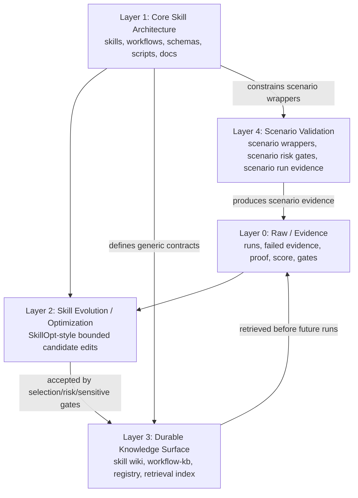

# Architecture

## Project Positioning

`awesome-skill-workflows` is an evidence-first framework for turning repeated AI
agent runs into reusable, measurable, improvable, and auditable workflow skills.

It is not a SkillOpt official clone, a static skill wiki, a prompt collection, or
a Xiaohongshu automation tool. Xiaohongshu is only the current validation
scenario. The durable product boundary is the workflow evidence and skill
evolution framework.

## Five-Layer Architecture



### Layer 0: Raw / Evidence

Layer 0 records what happened in a specific agent run.

Primary homes:

- `runs/`
- `failed-recipes/`
- run-local proof files, score files, gate ledgers, rejected candidates, and
  optimizer artifacts

Responsibilities:

- preserve inputs, outputs, scores, gates, proof, failures, and review traces;
- keep successful and failed evidence available for later learning;
- provide the evidence chain used by promotion decisions.

Boundary:

- A run is evidence, not reusable truth.
- Future agents should not use `runs/<run-id>/best_skill.md` or temporary run
  notes as canonical knowledge unless a promotion manifest explicitly links that
  artifact to a durable wiki or KB asset.

### Layer 1: Core Skill Architecture

Layer 1 defines scenario-agnostic framework contracts.

Primary homes:

- `skills/`
- `workflows/`
- `schemas/`
- `scripts/`
- `docs/`
- `AGENTS.md`, `TOOLS.md`, `MEMORY.md`

Responsibilities:

- define skill primitives, workflow composition rules, evidence contracts, and
  validation gates;
- keep schemas and validators as architecture gatekeepers;
- describe generic promotion, sensitive-data, and retrieval boundaries.

Boundary:

- Platform-specific assumptions, account-state rules, and scenario risk gates do
  not belong in generic Layer 1 assets unless they are clearly marked examples.

### Layer 2: Skill Evolution / Optimization

Layer 2 turns scored run evidence into candidate skill updates.

Primary homes:

- `runs/<run-id>/skill-optimization-run.json`
- `runs/<run-id>/generated-edits.json`
- `runs/<run-id>/candidate-skill.md`
- `runs/<run-id>/best_skill.md`
- optimizer-side history, runtime state, rejected buffers, and local training
  artifacts

Responsibilities:

- generate bounded candidate edits from scored evidence;
- keep train, selection, and optional test evidence split;
- accept only when held-out selection evidence improves the metric and required
  gates remain compatible;
- preserve rejected candidates as negative evidence.

Boundary:

- SkillOpt-style optimization produces candidate updates; it is not the final
  knowledge base and not the user consumption surface.
- Optimizer history, runtime state, slow/meta notes, and rejected candidates must
  not be copied into `skills/wiki/`.

### Layer 3: Durable Knowledge Surface

Layer 3 is the reusable memory surface for future agents.

Primary homes:

- `skills/wiki/`
- `skills/index.json`
- `workflow-kb/`
- `workflow-kb/retrieval-index.json`

Responsibilities:

- store promoted canonical skill pages;
- keep machine-readable registry and retrieval hooks small and filterable;
- store verified workflows, composition patterns, evaluation rubrics, failure
  cases, fallback strategies, reusable prompts, and retrieval indexes;
- let future agents decide what to reuse without reading every raw run first.

Boundary:

- Durable assets must have explicit evidence references and promotion status.
- Retrieval records should point to reusable assets, not temporary training
  artifacts.

### Layer 4: Scenario Validation

Layer 4 validates the architecture through concrete workflows.

Primary homes:

- `scenarios/`
- `workflows/<scenario>/`
- scenario-specific run evidence under `runs/`

Responsibilities:

- define scenario boundaries, scoring rubrics, and risk gates;
- prove the generic architecture on a concrete workflow;
- keep platform- or account-specific assumptions local to the scenario.

Boundary:

- A scenario can prove the architecture, but it must not define the architecture.
- Scenario-specific safety assumptions must not leak into generic Layer 1
  contracts or generic wiki skills.

## SkillOpt To Skill Wiki Promotion Flow

```text
raw discovery / prior KB / run evidence
  -> SkillOpt-style optimization
  -> runs/<run-id>/skill-optimization-run.json
  -> selection gate + risk gate + sensitive gate
  -> promotion decision
  -> runs/<run-id>/promotion-manifest.json
  -> skills/wiki/<skill-id>.md
  -> skills/index.json
  -> workflow-kb/retrieval-index.json
  -> future agent retrieval
```

Principles:

- SkillOpt-style optimization generates candidate skill edits.
- Skill Wiki stores normalized canonical skill contracts.
- `runs/<run-id>/best_skill.md` is a source artifact, not a wiki page.
- Promotion requires a traceable manifest that links the accepted artifact to the
  wiki page, registry record, retrieval record, required gates, evidence refs,
  and sensitive-data status.

## Module Boundaries

| Module | Primary role | Not allowed |
| --- | --- | --- |
| `runs/` | Evidence from specific executions | Reusable truth by default |
| `skills/wiki/` | Promoted canonical skill pages | Raw optimizer output or rejected candidates |
| `skills/index.json` | Machine-readable skill registry | Long-form skill body or temporary notes |
| `workflow-kb/` | Durable workflow memory | Unverified run scratch |
| `workflow-kb/retrieval-index.json` | Cross-KB retrieval hook | Temporary training artifacts |
| `schemas/` | Data contracts | Scenario-specific business assumptions |
| `scripts/` | Validation gatekeepers | Silent promotion without evidence |
| `scenarios/` | Scenario-local validation wrappers | Generic architecture rules |

For detailed placement rules, see `docs/directory-architecture.md`.
